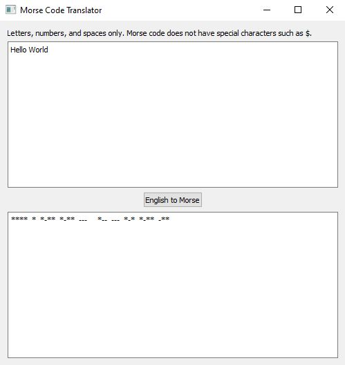

For application: Download pythonMorseCodeTranslator.exe for application
1) Make sure user is viewing base directory MorseCodeTranslator
2) Click on pythonMorseCodeTranslator.exe and transported to code page
3) Click on Download
4) Download the file
5) Windows or Mac will flag as possible malicious software. Bypass security depending on OS. 
6) If unwilling to download or lacking bypass procedures, refer to image below.

For images or download reservations: See below.
